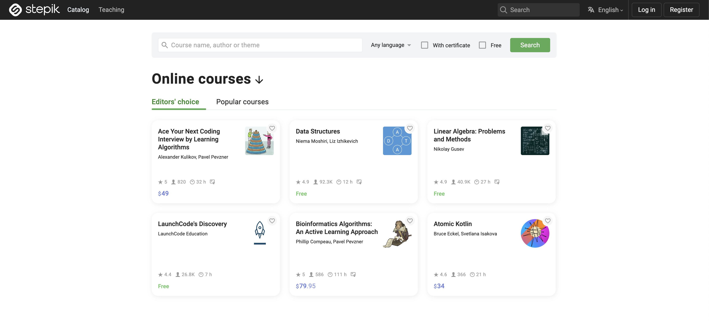

# Automated tests for [stepik.org](https://stepik.org/)

> Stepik is a platform with the best online courses devoted to Computer Science and everything tech-related. Learn data structures, Python programming, statistics and many other useful skills. Access video lectures and assignments on the go.



## :pushpin: Content:

- [Stack of technologies](#computer-stack-of-technologies)
- [Running tests](#running_woman-running-tests)
- [Build in Jenkins](#-build-in-jenkins)
- [Allure report](#-allure-report)
- [Allure TestOps Integration](#-allure-testops-integration)
- [Telegram notifications](#-telegram-notifications)


## :computer: Stack of technologies

<p align="center">

<a href="https://rest-assured.io/"></a>


</p>

## :rocket: Running tests

If necessary, you can override the launch options:

```
clean
build
-DbaseUrl=${BASE_URL}
-Demail=${EMAIL}
-Dpassword=${PASSWORD}
```

##  Build in [Jenkins](https://jenkins.autotests.cloud/job/final_project_eviush/)
<p align="center">


</p>

##  [Allure](https://jenkins.autotests.cloud/job/final_project_eviush/14/allure/) report
### Overview

<p align="center">

</p>

### Test result

<p align="center">

</p>

##  [Allure TestOps](https://allure.autotests.cloud/launch/25480) Integration

Also we can connect <code>Jenkins</code> to the commercial version of <code>Allure</code>, which provides an opportunity to add there manual tests as well as an automated ones:

<p align="center">

</p>

##  Telegram notifications

<p align="center">

</p>